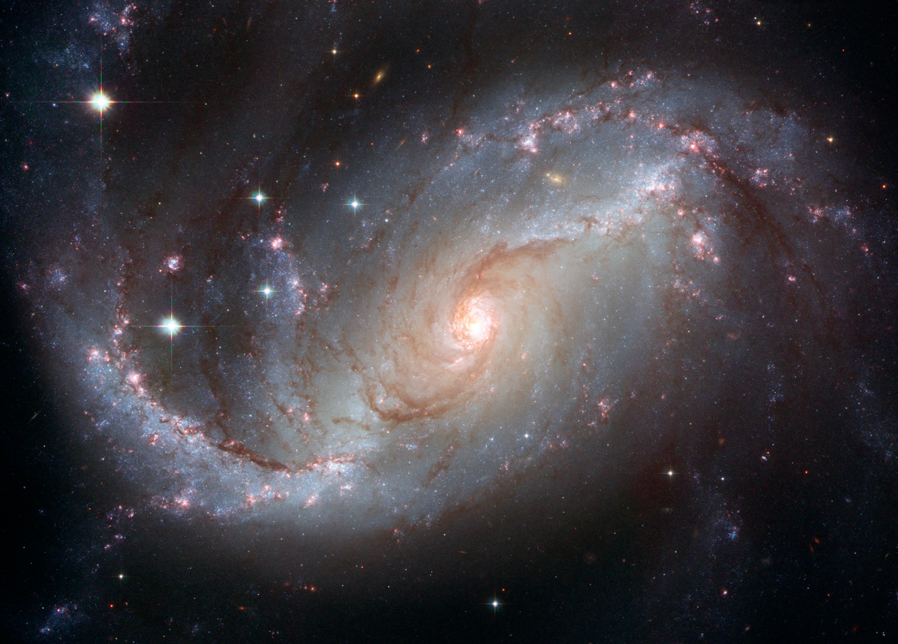

# Xiaoqing Chen

### Geography

I was born in Shanghai and grew up near the Bund. 
I'm currently doing a PhD in Mathematics (Spatial Statistics) in Exeter, UK

### Hobbies

My hobbies are:

- Learning advanced Mathematical and Statistical Theory
- Practicing Caligraphy
- Playing Arduino
- Swimming
- Taking photographs for cats
- Cooking (this is a newly developed one) 

### Contact

The best way to get in touch with me is [on Twitter](https://twitter.com/xiaoqingchen).

### Photos 

